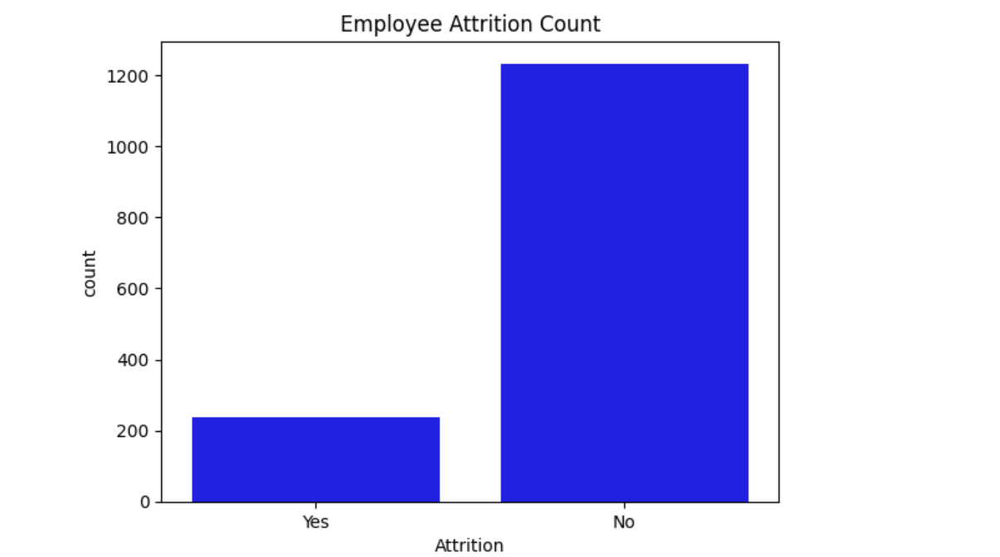
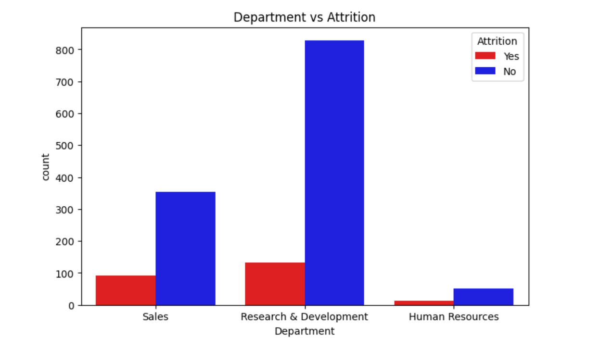
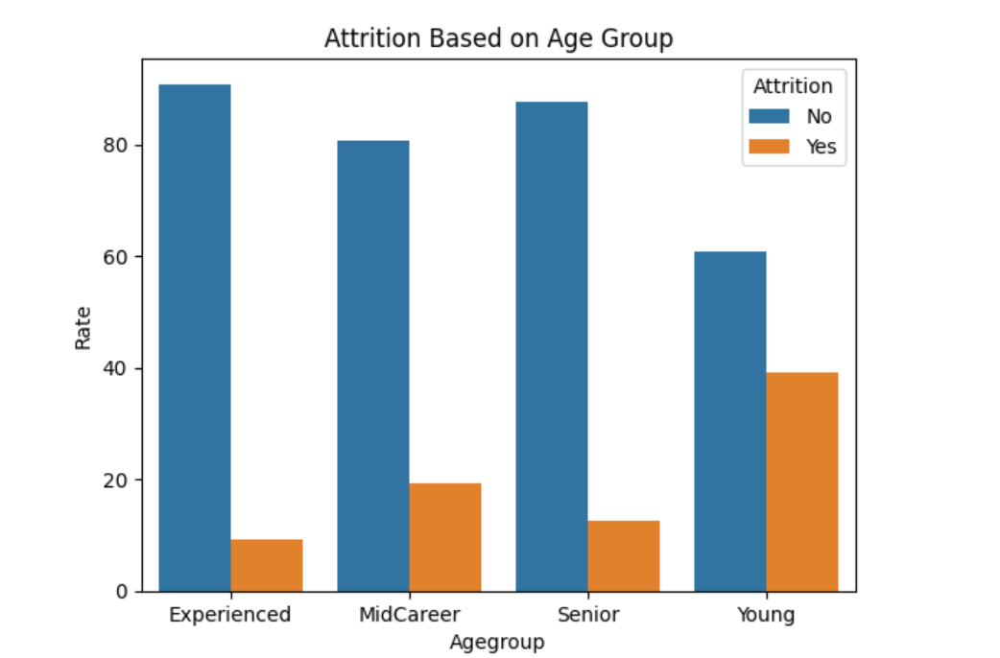
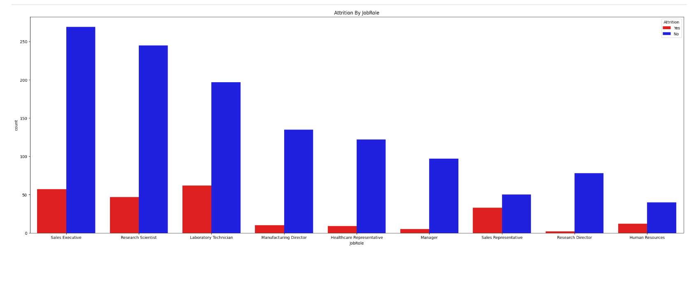
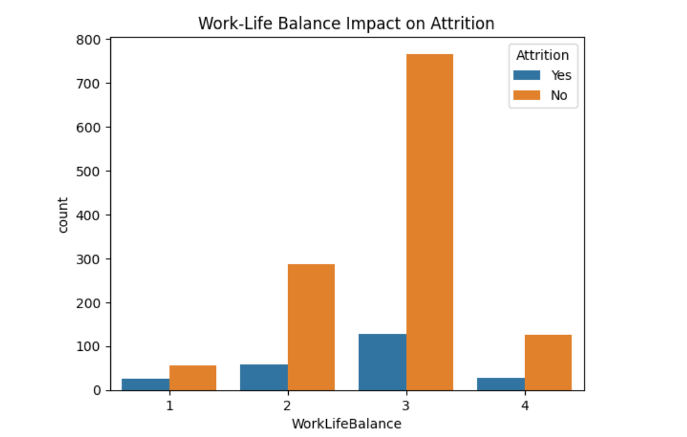
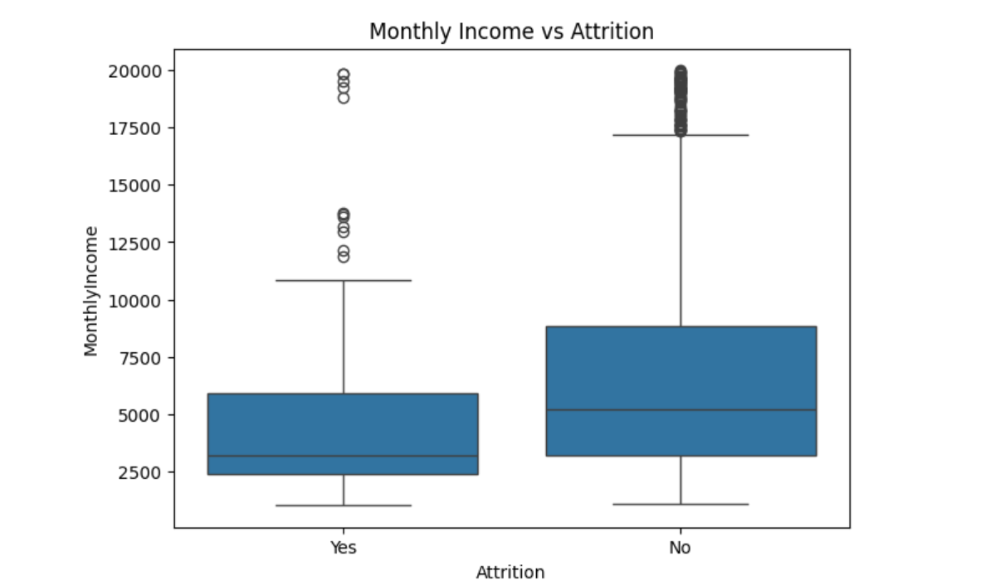

# 📊 HR Analytics & Employee Attrition Analysis

This project focuses on analyzing workforce attrition using the IBM HR dataset.

The objective is to understand why employees leave, and to identify the key factors influencing resignation risk based on age, salary, department, job role, work-life 
balance, satisfaction scores, and experience.

The entire workflow — SQL → Python → Visual Insights → HR Recommendations — is implemented end-to-end for a real-world data analytics scenario.

## 🔥 Quick Summary

| Insight                                            | Interpretation                                |
| --------------------------------------             | --------------------------------------------- |

| Overall Attrition ≈ 16–18%                         | Moderate employee turnover rate               |

| Highest Risk Age Group → **25–35 yrs**             | Mid-career professionals actively switch jobs |

| Low Salary → Higher Attrition                      | Compensation is a strong driver of exits      |

| Sales & R&D = Highest churn                        | High workload + competitive pressure          |

| Senior Employees (40+) = Most stable               | More loyal and satisfied with role            |

## 🧰 Tech Stack

| Area                              |    Tools Used                           |

| ------------------                | ------------------------------------ |

| Database                          | MySQL                                |

| Analytics                         | Python (Pandas, NumPy)               |

| Visualization                     | Matplotlib, Seaborn                  |

## 📁 Repository Structure

HR-Analytics-Attrition-Prediction/

HR-Analytics-Attrition-Prediction/

│── SQL_Queries.sql                → All SQL queries (cleaning + analysis)

│── HR_Attrition_Analysis.ipynb    → Python EDA + visual graphs inside notebook

│── Employee_Attrition.csv         → Dataset used for analysis

│── requirements.txt               → Python dependency file

│── README.md                      → Project description & documentation

│── Visuals

## 🧽 Data Cleaning & Preparation (SQL)

Conducted null and duplicate checks

Checked invalid values and data consistency

Detected outliers using IQR logic (Age)

Created derived feature → AgeGroup

Performed SQL-based attrition analytics

## 📊 Exploratory Insights (Python)

 Visualizations performed include:

 Attrition count distribution

 Department-wise attrition comparison

 Monthly income vs attrition (boxplot)

 Age group-wise attrition rate
 
 Job role vs attrition

 ## 📊 Visual Insights

### 🔹 Overall Attrition

### 🔹 Department Wise Attrition

### 🔹 Attrition By Agegroup

### 🔹 Attrition By Jobrole

### 🔹 Attrition By Worklifebalance

### 🔹 Attrition By Salary

 # 📌 Business Conclusion

Attrition is significantly influenced by salary, age group, department, and job role.

Mid-career employees (25–35) with lower income are more likely to leave.

Retention strategies should focus on career growth, compensation upgrades, and work-life balance improvement for this population.
